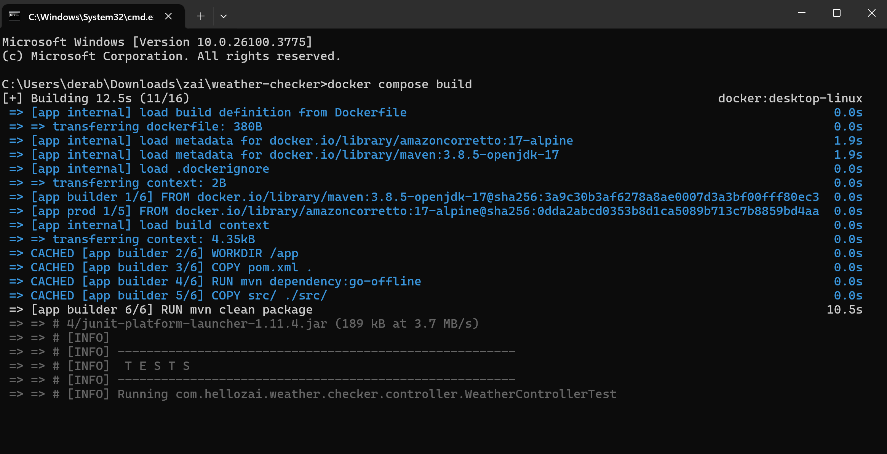
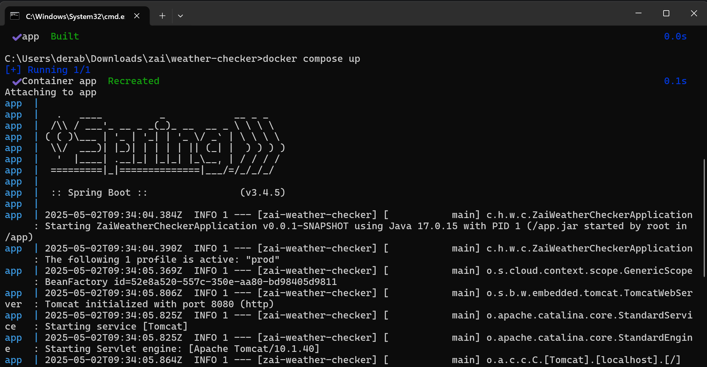
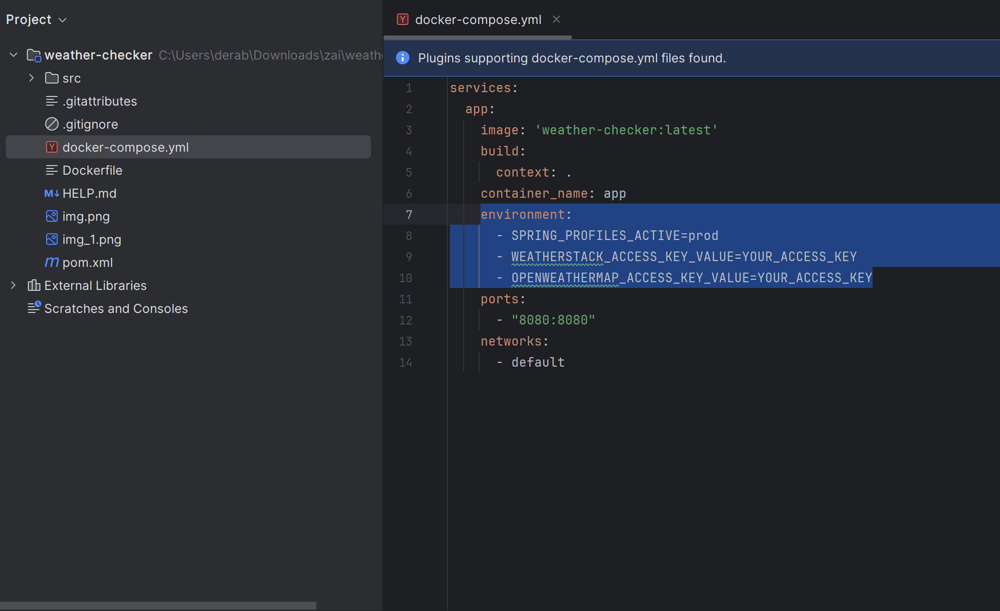

# Task
* The service can hard-code Melbourne as a city.
* The service should return a JSON payload with a unified response
containing temperature in degrees Celsius and wind speed.
* If one of the provider goes down, your service can quickly failover to a
different provider without affecting your customers.
* Have scalability and reliability in mind when designing the solution.
* Weather results are fine to be cached for up to 3 seconds on the server in
normal behaviour to prevent hitting weather providers. Those results must
be served as stale if all weather providers are down.

## Zai Code Challenge 2
* The proposed solution should allow new developers to make changes to the
code safely.

# How to run the application

## Docker
### Building the docker image

**Pre-requisites:**
*You can run docker commands in your machine. Refer to: https://docs.docker.com/engine/install/*

1. Run: `docker compose build`

2. Run: `docker compose up`

## Configuring the environment variables.
You may configure the environment variables for the application via editing the docker-compose.yml file.

*It is imperative that you obtain the necessary api/access keys for the 3rd party service that the application is connecting to.*